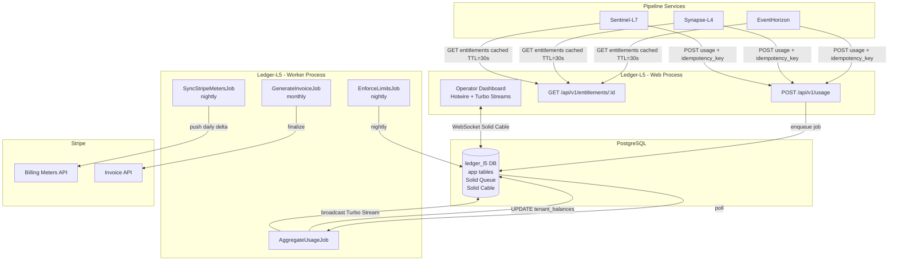
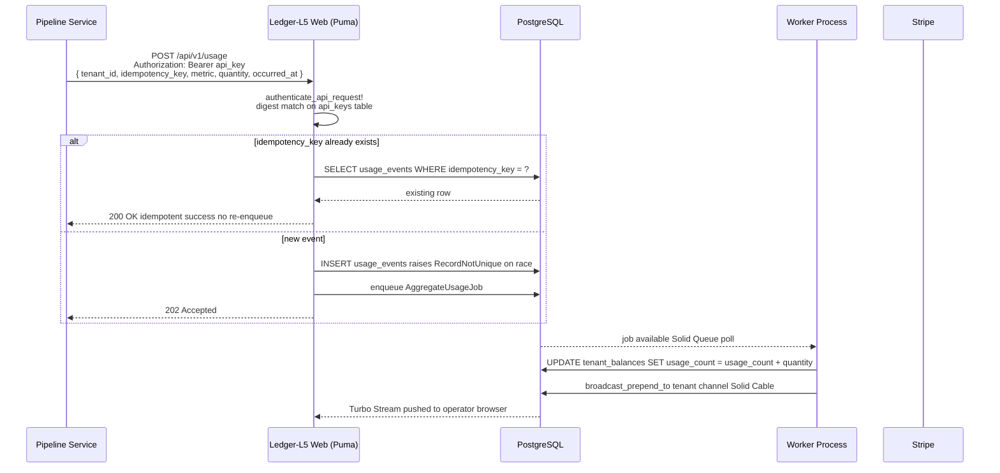
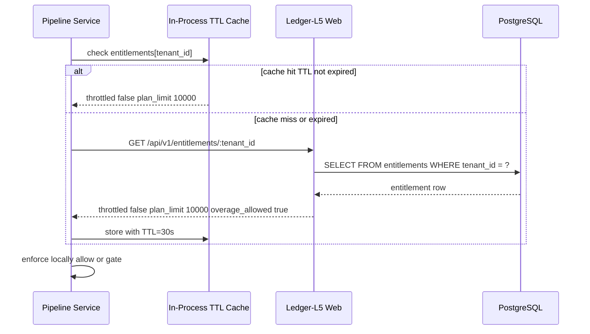
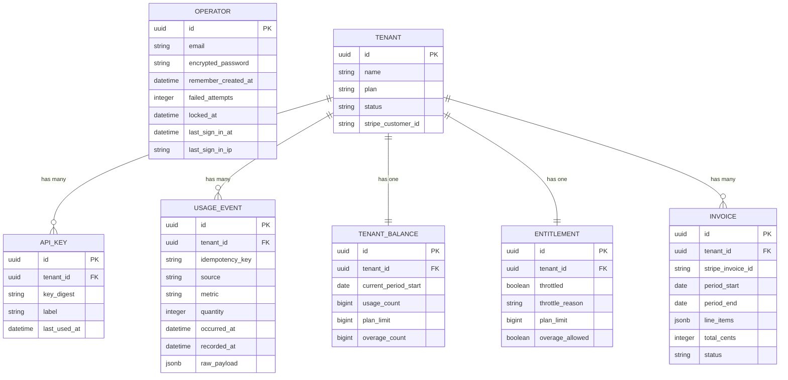
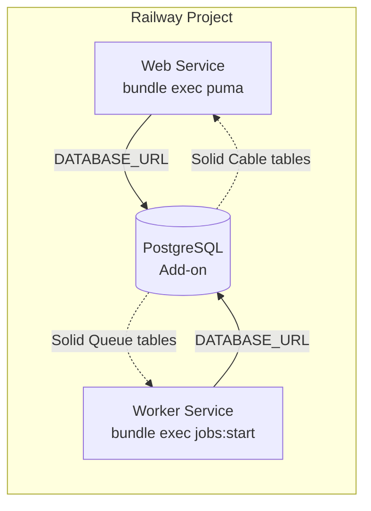

# Ledger-L5 — Architecture

## System Overview

Ledger-L5 is the commercial layer of the EventHorizon → Synapse-L4 → Sentinel-L7 portfolio. Pipeline services report usage events to Ledger-L5; Ledger-L5 aggregates, meters, and bills. Entitlement state flows back to pipeline services via a poll endpoint (unidirectional coupling — see ADR 0005).

---

## Usage Ingestion — Request Lifecycle

---

## Entitlement Read Path

**Fail-open:** if Ledger-L5 is unreachable, pipeline uses stale cached value until TTL expires, then fails open (allows traffic). Documented in ADR 0005.

---

## Domain Model

---

## Railway Deployment Topology

Both services share one `DATABASE_URL`. No Redis. No Sidekiq. No Pusher.
